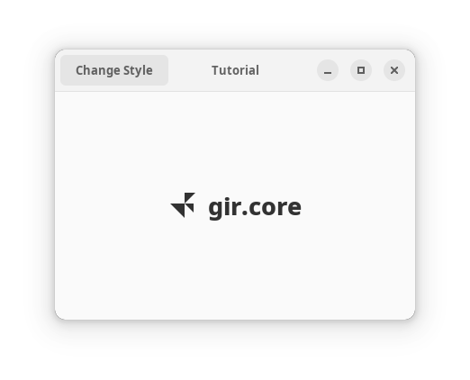

# Minimal project

Let's start with a minimal project. An application with a single window, containing headerbar, a button to change application style (light/dark), an icon and a label. In the following parts of the tutorial we will slightly change the app.



Our C# code will be places in `src`. It's important to keep the code in subfolder because later we will have some other files and another folder for extra data.

Even with a minimal project, there is a couple of things in the code worth looking into.

## Application ID

```csharp
_application = Adw.Application.New("io.github.fsobolev.GirCoreExtrasTutorial", Gio.ApplicationFlags.DefaultFlags);
```

The first argument here is your application's ID. The ID will be used in some other places as well. And while the application could run with pretty much any string as ID, there are strict rules you should follow for your ID to be correct, and you want a correct ID if you want to publish and then validate your app on Flathub. The ID must be unique and must follow reverse-DNS scheme: `{top_level_domain}.{vendor}.{product}`. You must either be an owner of `{vendor}.{top_level_domain}` (i.e. you should own a site with such address) or use a domain that delegates IDs, like GitHub: if your project has a repository on GitHub, you can use this scheme: `io.github.{username}.{repo_name}`, just like I use in this tutorial.

You can read more about applications IDs at [Flatpak site](https://docs.flatpak.org/en/latest/conventions.html#application-ids) and in [Appstream specification docs](https://www.freedesktop.org/software/appstream/docs/chap-Metadata.html#tag-id-generic).

## Synchromization context

```csharp
_application.RunWithSynchronizationContext();
```

You could use `_application.Run()`, but if you're going to use async methods in your code, `RunWithSynchronizationContext()` is really helpful. Using it guarantees that after `await`ing a function, the code that goes after it will continue to run on main (GTK) thread. This is important, because GTK is not thread-safe, and executing GTK calls on wrong thread can cause random crashes that are hard to debug.