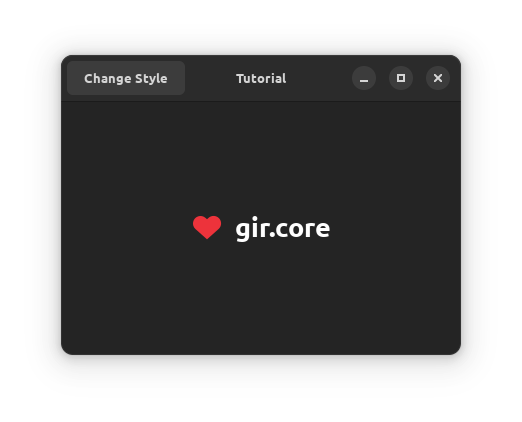

# Resources

[GResource](https://docs.gtk.org/gio/struct.Resource.html) is a special file format for storing resources like icons ans CSS files to be loaded by an application. To use GResource, you need to create an XML file describing what resources to bundle, then the GResource file should be compiled and provided together with your app.

Let's look at the content of the [XML file](src/resources/io.github.fsobolev.GirCoreExtrasTutorial.gresource.xml).

```xml
<?xml version="1.0" encoding="UTF-8"?>
<gresources>
    <gresource prefix="/io/github/fsobolev/GirCoreExtrasTutorial">
        <file alias="style.css">light.css</file>
        <file alias="style-dark.css">dark.css</file>
    </gresource>
    <gresource prefix="/io/github/fsobolev/GirCoreExtrasTutorial/icons/scalable/status/">
        <file preprocess="xml-stripblanks">heart-filled-symbolic.svg</file>
    </gresource>
</gresources>
```

We are bundling CSS files and one icon. Each `gresource` has `prefix` that sets an internal path for where to place the resources. It starts with a path created from your app ID (let's call it "root"), followed by other folders if needed.

## CSS

To be automatically loaded by GTK application, CSS files should be in "root" and should be known as `style.css` (used for both light and dark styles) and `style-dark.css` (used only with dark style, overriding the code from `style.css`), that's why you need to set aliases if your files are named differently.

In this example we are doing a simple thing: adding a custom CSS class to be used with our icon, and changing its color.

```css
.main-icon {
    color: @purple_5;
}
```

`@purple_5` is one of named colors in Adwaita, you can read about named colors [here](https://gnome.pages.gitlab.gnome.org/libadwaita/doc/main/named-colors.html).

Applying a CSS class to a widget is very simple:

```csharp
icon.AddCssClass("main-icon");
```

## Icons

Icons should be placed in `<root>/icons/<size>/<context>`, similar to how icons are located in [icon themes](https://specifications.freedesktop.org/icon-theme-spec/icon-theme-spec-latest.html). Because the icon we use is an SVG icon, we choose `scalable` size, and for context let's use `status` (you can read more about contexts [here](https://specifications.freedesktop.org/icon-naming-spec/icon-naming-spec-latest.html#context)).

But why do even need to use GResource for icons? If an icon is available in an icon theme on the user's system, it can be used without extra work. And if it's not available, we still could provide an icon as a separate file, installing it into `<prefix>/share/icons/hicolor/...`. But there's one problem related to packaging. Let's say you provide an icon as a separate file. But then another application uses the same icon, and installs it in the same path under the same name. It creates files conflict when applications are meant to be installed with system package managers where packages are not isolated from each other (in Flatpak and Snap they are isolated). So the user will not be able to install both applications at the same time - because of just one tiny icon creating a conflict.

There's one very useful application - [Icon Library](https://flathub.org/apps/org.gnome.design.IconLibrary). It provides a big collection of Adwaita-styled symbolic icons. You can see there a category of pre-installed system icons - these are the icons that are available with the default Adwaita icon theme, and so they don't need to be embedded in a GResource to be used. For other icons, you can export them from the application and save in your project. The icon we use in this tutorial - `heart-filled-symbolic` - is from the library.

## Compiling and loading GResource

Let's modify csproj file to compile GResource when building the app and place it in output directory for build and publish:

```xml
<Target Name="PreBuild" BeforeTargets="PreBuildEvent">
    <Exec Command="glib-compile-resources --sourcedir ./resources ./resources/io.github.fsobolev.GirCoreExtrasTutorial.gresource.xml --target=$(OutDir)/io.github.fsobolev.GirCoreExtrasTutorial.gresource" />
</Target>

<Target Name="PostPublish" AfterTargets="Publish">
    <Exec Command="cp $(OutDir)/io.github.fsobolev.GirCoreExtrasTutorial.gresource $(PublishDir)/io.github.fsobolev.GirCoreExtrasTutorial.gresource" />
</Target>
```

Make sure you have `glib-compile-resources` program installed on your system.

Now that we placed compiled file in output directory, let's load it in `Program.cs`:

```csharp
var location = Path.GetFullPath(Path.GetDirectoryName(Assembly.GetExecutingAssembly().Location)!);
if (File.Exists($"{location}/io.github.fsobolev.GirCoreExtrasTutorial.gresource"))
{
    Gio.Functions.ResourcesRegister(Gio.Functions.ResourceLoad($"{location}/io.github.fsobolev.GirCoreExtrasTutorial.gresource"));
}
```

We check that the file exists first to avoid crash that would happen if `Gio.Functions.ResourceLoad` would try to load a file that doesn't exist.

Now everything is in place and you can build and run the program to see that the heart icon color changes depending on the style.

